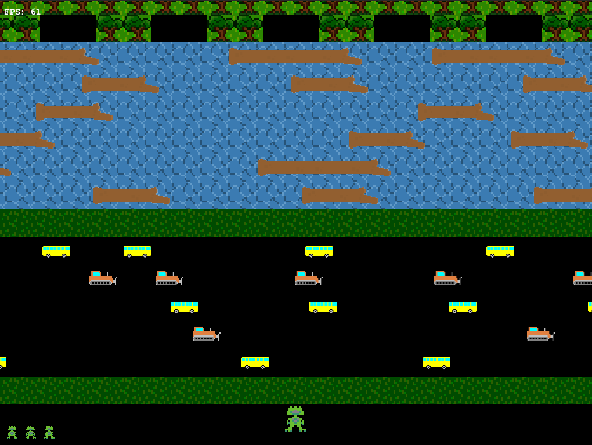
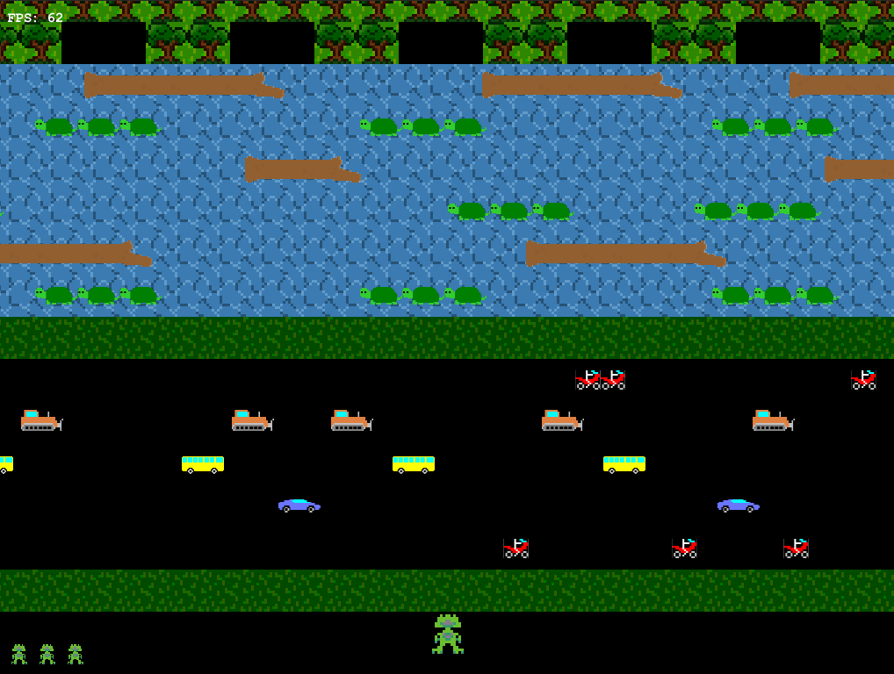

# SWEN20003-Object-Oriented-Software-Development-Arcade-Game-Shadow-Leap
# Introduction
Shadow Leap is a graphical arcade game  project for the subject SWEN20003 Objected Oriented Software Development in 2018 semester 2.

Level 1 of Game            |  Level 2 of Game
:-------------------------:|:-------------------------:
 | 

# Usage
  - Require JDK of version 8.
  - Open the software with Intellij Idea or Eclipse. 

# File Structure
```
|- doc
    |- project1.pdf  // The specification for project 1.
    |- project2.pdf  // The specification for project 2.
|- src // The source code of this game.
```
